# GamePort

**Your Steam games for Steam Frame, on your Quest, Pico or any Android device.**

GamePort is a free, open-source app that signs in to your Steam account, shows the Android versions of the games you own (and those shared by your Steam family), and takes care of everything else: download, install, launch. Your saves follow you through Steam Cloud, and your play time counts on your account.

> GamePort is an independent community project. It is not made by, or affiliated with, Valve, Meta or Pico.

## A look

  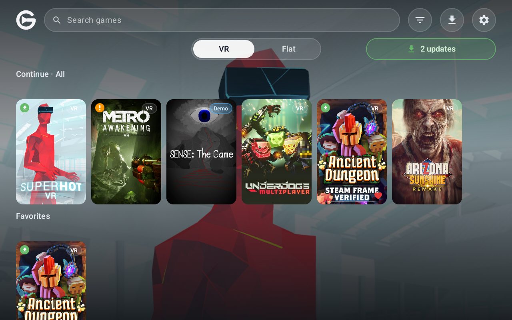
  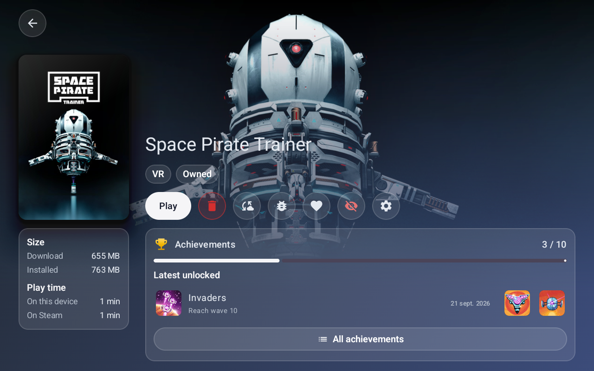

  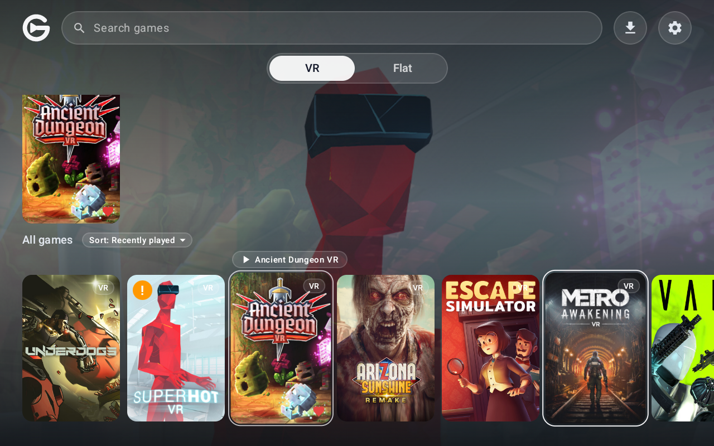
  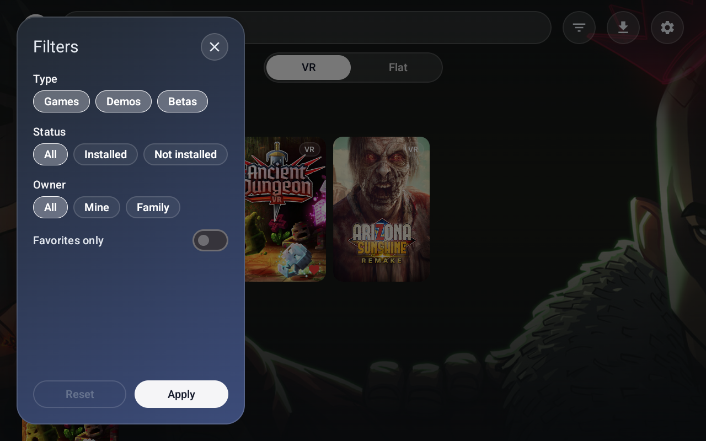

  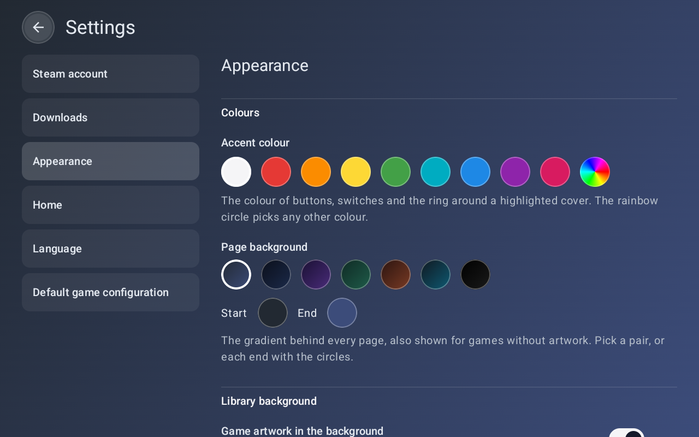
  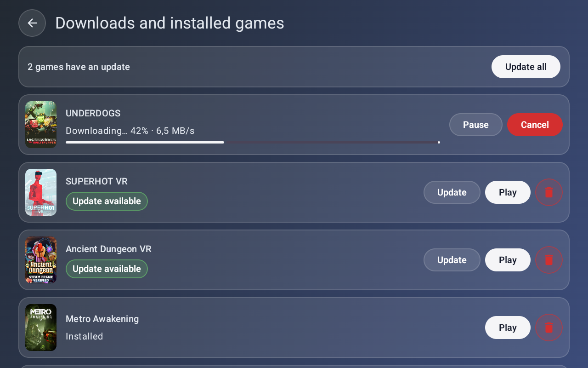

  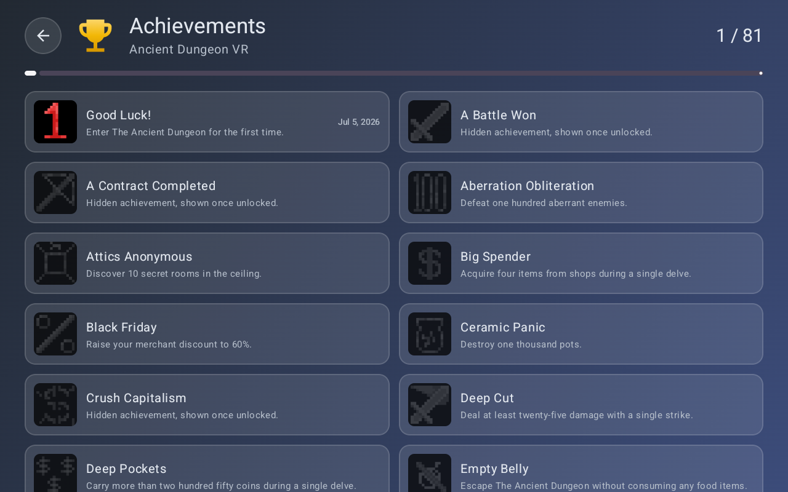

  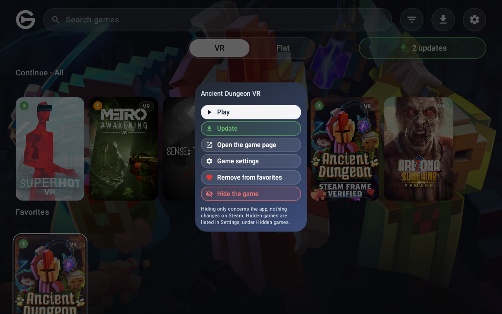
  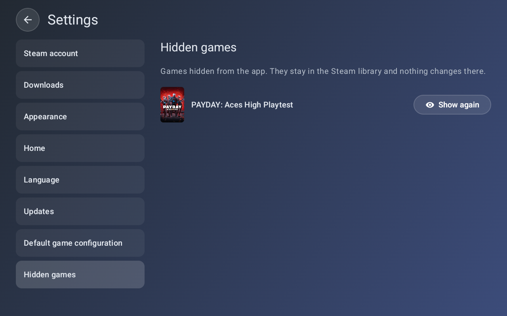

  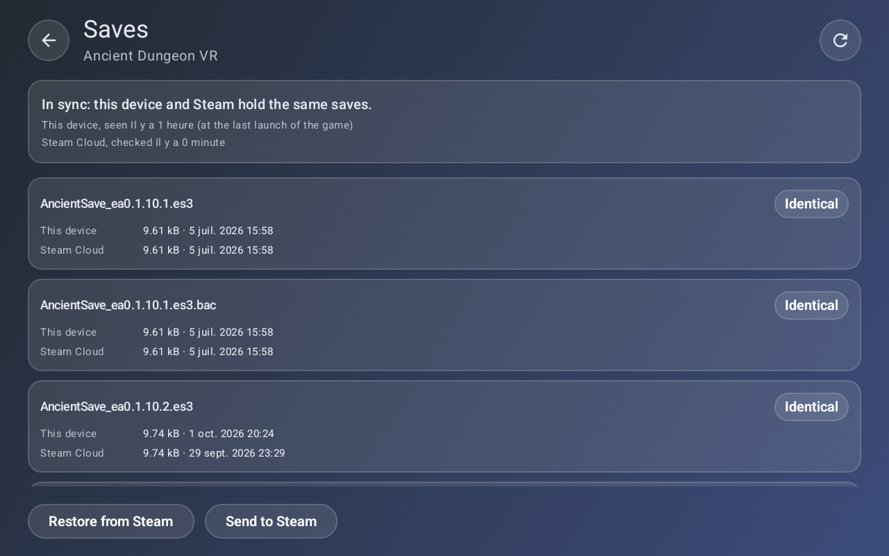
  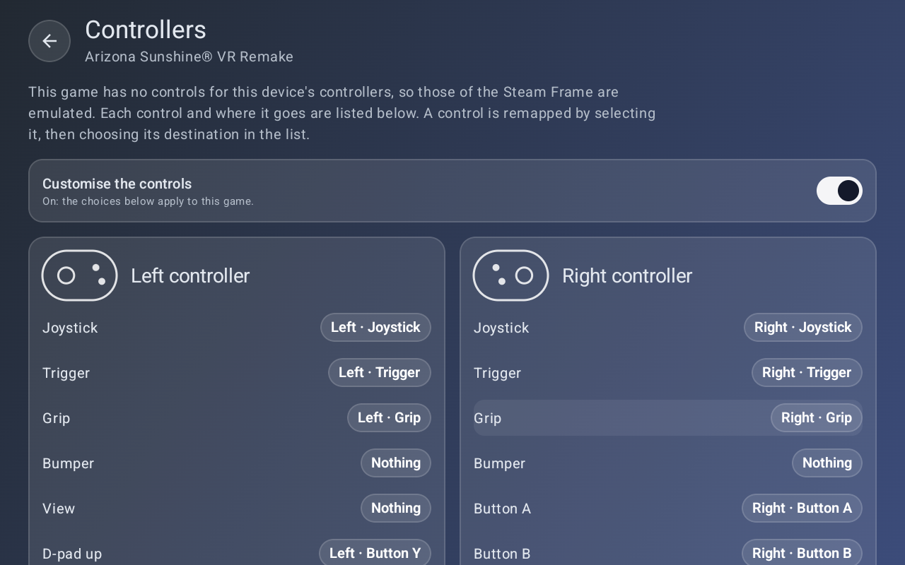

## What it does

- **Your library, nicely laid out.** VR and flat games, demos and betas, search, filters, favorites, a "Continue" row with what you played last, and a look you can make yours: cover size, colours, background, language.
- **One tap to install.** GamePort downloads the game, prepares it so it runs on your device, and installs it. It tells you when a game has a new version.
- **Your Steam account, your saves.** Games run under your own account. Saves are kept in sync with Steam Cloud, and a page per game lets you choose what to restore or send.
- **Play time that counts.** The time you play is added to your Steam account, and only while the game is really on screen: not while the device sleeps.
- **Your controllers, your way.** Games made for the Steam Frame controllers get translated onto yours. You can change the mapping game by game.
- **Made for headsets, friendly to phones and tablets.** On a phone or a tablet, everything that belongs to VR simply disappears.

## Works on

- Meta Quest (2, 3, 3S, Pro)
- Pico (4, 4 Ultra and others)
- Other Android headsets, as long as they run OpenXR games
- Android phones and tablets, for the games that are not VR

## Getting started

1. Download the latest APK from the [releases page](https://github.com/gameport-project/gameport-app/releases/latest) and install it on your device (sideloading).
2. Open it and scan the QR code with the Steam app on your phone to sign in. Your password never goes through GamePort.
3. Pick a game in your library and tap **Install**.
4. Tap **Play**.

The first time a game needs a permission, GamePort explains why before asking.

## Good to know

- **Every game is its own adventure.** These games were not made for your device, so GamePort tests them one by one. The list of what works, what does not and why is in [docs/COMPATIBILITY_TESTING.md](docs/COMPATIBILITY_TESTING.md).
- **Online features may not work** in some games. Single player and saves are the focus today.
- **One game at a time per Steam account.** Steam only allows a single game to be played on an account at once, so starting a game on your headset pauses one running on your PC. You can switch off play-time counting in the settings if you prefer.
- **You must own the game.** GamePort only handles games on your account or shared with your Steam family.

## When a game does not work

Open the game's page and press the bug button, or the **Report a problem** button that appears when an install fails. GamePort also points it out on a game that closed right away or crashed.

- **Save the report.** It makes a zip in the Downloads folder of your device. It holds the versions, the device, the game's files, its log and GamePort's, how its last runs ended, and what GamePort did for it.
- **Nothing is sent by GamePort.** You choose what to do with the file: attach it to a [ticket](https://github.com/gameport-project/gameport-app/issues/new?template=game-problem.md), or send it to the developers by any means.
- **Your identity stays out.** Account numbers, e-mail addresses, network addresses and your account name are removed from the text files. The crash report Android keeps, when there is one, is a binary file and is not filtered.
- **It cleans up after itself.** What GamePort keeps for reports is deleted after a week, and when the game is uninstalled. The zips you saved are yours and are never touched.

## Your privacy

- Your sign-in stays on your device. It is never sent anywhere except to Steam.
- GamePort shows no ads that track you and collects nothing about you.
- When it opens, GamePort can look at the latest release page on GitHub to tell you a newer version exists (every 4 hours by default; the delay, or Never, is a setting). It only looks: nothing is downloaded or installed without a tap, and GitHub sees your IP address like for any web page.
- It is free and will stay free: no paid app, no paywall.

## Open source

GamePort is built in the open, with the help of other free projects: a Steam emulation layer based on the [Goldberg Steam Emulator](https://gitlab.com/Mr_Goldberg/goldberg_emulator), ideas and code from [ovrport](https://github.com/ovrport/app), and [JavaSteam](https://github.com/Longi94/JavaSteam) to talk to Steam. Everything we reuse, with its licence, is listed in [docs/THIRD_PARTY_NOTICES.md](docs/THIRD_PARTY_NOTICES.md).

- The part that fakes Steam inside the games lives in its own repository: **gameport-steamworks-shim**.
- Want to build it yourself or lend a hand? See [docs/DEVELOPMENT.md](docs/DEVELOPMENT.md).

Français : [README.fr.md](README.fr.md)
